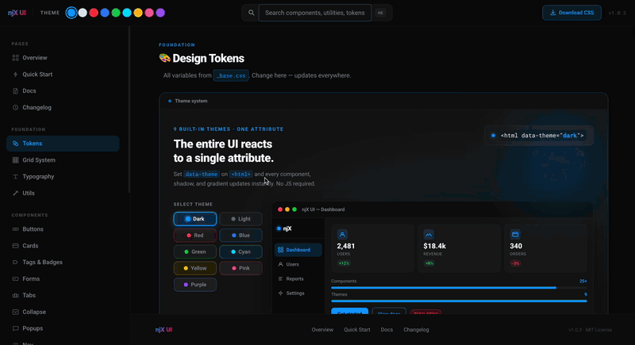
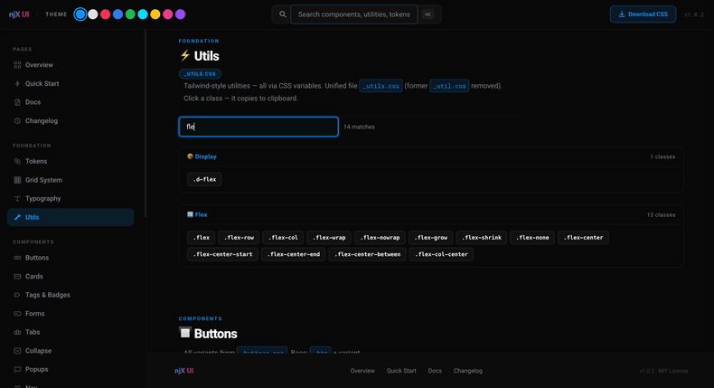
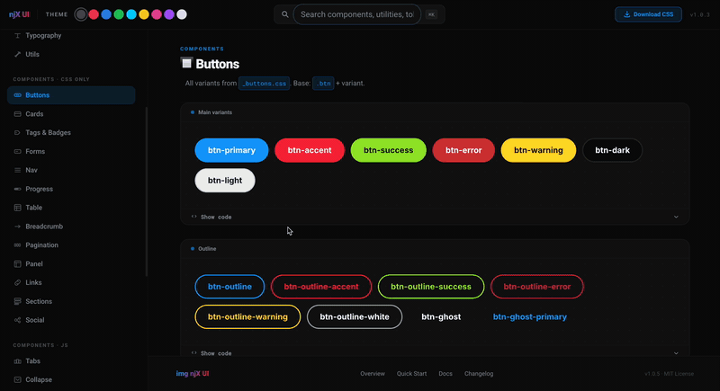
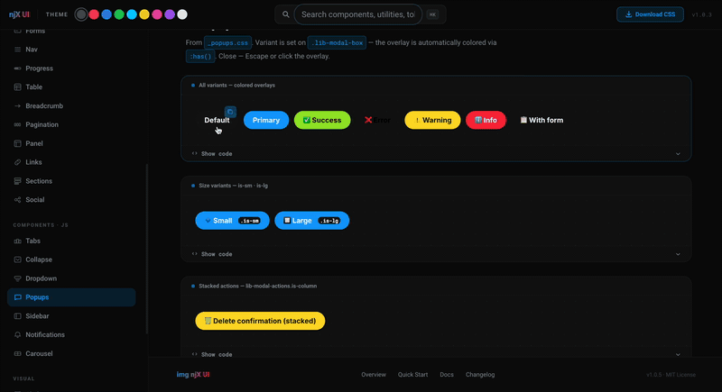
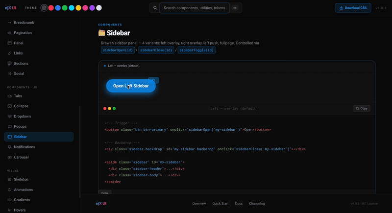
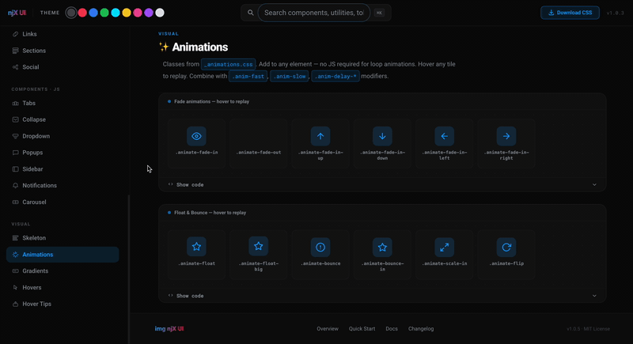
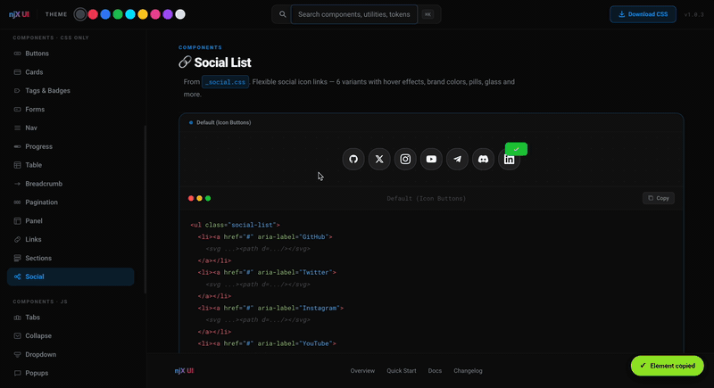

# njX UI

**njX UI** (npm: [`njx-ui`](https://www.npmjs.com/package/njx-ui)) is a zero-dependency CSS component library for landing pages, docs and prototypes: **9 themes, 30+ components, Tailwind-style utilities** — 308 KB minified, **44 KB gzip over the wire**, no build step. Plays great with [Astro](#use-with-astro-) and [Alpine.js](#alpinejs--the-ui-kit-alpine-was-missing-).

One link — everything works:

```html
<link rel="stylesheet" href="https://cdn.jsdelivr.net/npm/njx-ui@1/css/style.min.css">
<!-- optional interactivity helpers (modals, toasts, sidebar…) -->
<script src="https://cdn.jsdelivr.net/npm/njx-ui@1/js/njx.js"></script>
```

Docs & live demo: **[njxui.dev](https://njxui.dev)**

<div align="center">



[](https://www.npmjs.com/package/njx-ui)
[](LICENSE)
[](css/style.css)
[](js/njx.js)
[](#1-9-themes--one-attribute)
[](#components)

[How to use from GitHub](GITHUB.md) · [Contributing](CONTRIBUTING.md) · [Documentation](css/CSS-DOCS.en.md)

</div>

---

## Quick Start

Choose the method that fits your project:

---

### Option 1 — CDN (jsDelivr via npm)

No install. Just add to your HTML:

```html
<!DOCTYPE html>
<html data-theme="dark">
<head>
  <!-- Major version — always current v1.x (recommended) -->
  <link rel="stylesheet" href="https://cdn.jsdelivr.net/npm/njx-ui@1/css/style.min.css">
  <script src="https://cdn.jsdelivr.net/npm/njx-ui@1/js/njx.js"></script>

  <!-- Or pinned to an exact version — never changes -->
  <link rel="stylesheet" href="https://cdn.jsdelivr.net/npm/njx-ui@1.1.4/css/style.min.css">
</head>
<body>
  <button class="btn btn-primary">Primary</button>
  <div class="card mt-4">Card</div>
</body>
</html>
```

> jsDelivr may cache for 5–10 minutes after a new publish. If it doesn't load yet — wait a moment.

---

### Option 2 — CDN (jsDelivr via GitHub)

Works immediately after `git push`, without publishing to npm:

```html
<!-- Always latest from main branch -->
<link rel="stylesheet" href="https://cdn.jsdelivr.net/gh/njbSaab/njx-ui@main/css/style.min.css">
<script src="https://cdn.jsdelivr.net/gh/njbSaab/njx-ui@main/js/njx.js"></script>

<!-- Pinned to a specific tag -->
<link rel="stylesheet" href="https://cdn.jsdelivr.net/gh/njbSaab/njx-ui@v1.1.4/css/style.min.css">
```

---

### Option 3 — unpkg

```html
<link rel="stylesheet" href="https://unpkg.com/njx-ui/css/style.min.css">
<script src="https://unpkg.com/njx-ui/js/njx.js"></script>
```

---

### Option 4 — npm install

```bash
npm install njx-ui
```

Then in your HTML:

```html
<link rel="stylesheet" href="node_modules/njx-ui/css/style.min.css">
```

Or in a bundler / Astro / Vite project:

```js
import 'njx-ui/css/style.min.css';
```

Verify installed files:

```bash
ls node_modules/njx-ui/css/
# → style.css  style.min.css  _base.css  _buttons.css  ...
```

---

### Option 5 — Download

Download `css/style.min.css` and `js/njx.js` from the [releases](https://github.com/njbSaab/njx-css-ui/releases) and link locally:

```html
<link rel="stylesheet" href="css/style.min.css">
<script src="js/njx.js"></script>
```

---

### Verify CDN in browser

Open this URL to see all files available in the package:

```
https://cdn.jsdelivr.net/npm/njx-ui/
```

---

## Use with Astro 🚀

njX UI is zero-JS by default — a natural fit for Astro. The whole setup is one install and one import (no integration to register). The njX UI docs site itself is built with Astro.

```bash
npm install njx-ui   # pnpm add / yarn add / bun add
```

```astro
---
// src/layouts/Layout.astro
import 'njx-ui/css/style.min.css';
---
<html lang="en" data-theme="dark">
  <body><slot /></body>
</html>
```

Component classes now work in every `.astro` file, Markdown page and framework island:

```astro
<button class="btn btn-primary">Hello njX</button>
<div class="card-glow">
  <h2 class="text-gradient-primary">Works.</h2>
</div>
```

**Theme without flash (FOUC):** restore the saved theme before first paint with an inline script in `<head>`:

```html
<script is:inline>
  const t = localStorage.getItem('theme');
  if (t) document.documentElement.dataset.theme = t;
</script>
```

**Using `<ClientRouter />` (view transitions)?** njx.js initializes on `DOMContentLoaded`, so re-init carousels after navigation — or use Alpine.js, whose state lives in the markup and survives swaps:

```html
<script src="https://cdn.jsdelivr.net/npm/njx-ui@1/js/njx.js"></script>
<script>document.addEventListener('astro:page-load', () => initCarousels());</script>
```

---

## Alpine.js — the UI kit Alpine was missing 🏔

Every interactive njX component works by toggling a single state class (`.is-open`, `.is-active`, `.open`). njx.js is one way to toggle it — **Alpine.js is another**: keep the same markup and drive the class from `x-data`. No njX JavaScript required.

```html
<link rel="stylesheet" href="https://cdn.jsdelivr.net/npm/njx-ui@1/css/style.min.css">
<script defer src="https://cdn.jsdelivr.net/npm/alpinejs@3/dist/cdn.min.js"></script>
```

```html
<!-- Accordion: same .is-open class njx.js would toggle -->
<div class="collapse" x-data="{ open: false }" :class="{ 'is-open': open }">
  <div class="collapse-header" @click="open = !open">
    Title <span class="collapse-icon"></span>
  </div>
  <div class="collapse-body">Content</div>
</div>

<!-- Dropdown with outside-click close -->
<div class="dropdown" x-data="{ open: false }"
     :class="{ 'is-open': open }" @click.outside="open = false">
  <button class="btn btn-ghost btn-sm" @click="open = !open">Menu</button>
  <div class="dropdown-menu">
    <a href="#" class="dropdown-item" @click="open = false">Item</a>
  </div>
</div>
```

Ready-made recipes for tabs, modal (Escape + backdrop close), toast stack and a dark/light theme toggle: **[njxui.dev/documentation#alpine](https://njxui.dev/documentation#alpine)** — plus live demos with an Alpine.js tab in the code windows on the components page.

---

## Classless — now a separate project

The classless stylesheet (`classless.min.css`, ~7 KB gzip — styles plain semantic HTML with zero class names) has grown into its own product: **[classless.njxui.dev](https://classless.njxui.dev)**. The file still ships in this package for compatibility:

```html
<link rel="stylesheet" href="https://cdn.jsdelivr.net/npm/njx-ui@1/css/classless.min.css">
```

Reference → [classless.md](classless.md)

---

## Why njX?

### 1. 9 themes — one attribute

No extra CSS. No JS setup. Just set `data-theme` on `<html>` and every component updates instantly.

```html
<html data-theme="dark">    <!-- default -->
<html data-theme="light">
<html data-theme="red">
<html data-theme="blue">
<html data-theme="green">
<html data-theme="cyan">
<html data-theme="yellow">
<html data-theme="pink">
<html data-theme="purple">
```

Switch at runtime:
```js
document.documentElement.setAttribute('data-theme', 'purple')
```

---

### 2. Tailwind-style utility classes — no Tailwind required

Spacing, flexbox, typography, display, positioning — all available as single-purpose classes. No build step, no config, no `node_modules`.

<div align="center">



</div>

```html
<!-- Layout -->
<div class="flex items-center justify-between gap-4">...</div>
<div class="flex-col-center mt-8 mb-4">...</div>
<div class="w-full max-w-lg mx-auto">...</div>

<!-- Typography -->
<p class="text-sm text-muted font-bold">...</p>
<h1 class="text-gradient-primary">Gradient heading</h1>

<!-- Spacing -->
<div class="mt-4 mb-2 px-6 py-3">...</div>

<!-- Display -->
<div class="d-none">Hidden</div>
<div class="d-flex items-center gap-2">...</div>
```

**Responsive prefixes** — `sm:`, `md:`, `lg:`, `xl:` work out of the box:

```html
<div class="flex md:block lg:hidden">...</div>
<p class="text-base lg:text-xl">...</p>
```

Breakpoints: `sm` (≤ 640px) · `md` (≤ 768px) · `lg` (≤ 1024px) · `xl` (≤ 1280px)

#### Full utility reference

**Display**

| Class | CSS |
|---|---|
| `d-block` | `display: block` |
| `d-inline` | `display: inline` |
| `d-inline-block` | `display: inline-block` |
| `d-flex` / `flex` | `display: flex` |
| `d-grid` | `display: grid` |
| `d-none` / `hidden` | `display: none` |
| `visible` / `invisible` | `visibility: visible/hidden` |

**Flexbox**

| Class | CSS |
|---|---|
| `flex-row` / `flex-col` | `flex-direction` |
| `flex-wrap` / `flex-nowrap` | `flex-wrap` |
| `flex-grow` / `flex-shrink` / `flex-none` | flex sizing |
| `items-start/center/end/stretch/baseline` | `align-items` |
| `justify-start/center/end/between/around/evenly` | `justify-content` |
| `flex-center` | `display:flex` + center both axes |
| `flex-center-between` | `display:flex` + center + space-between |
| `flex-col-center` | `flex-col` + center both axes |
| `gap-0…gap-20` | `gap: var(--space-N)` |

**Spacing** — margin & padding scale: `0 1 2 3 4 5 6 8 10 12 16 20`

| Pattern | Classes |
|---|---|
| Margin all | `m-0`, `m-auto` |
| Margin axis | `mx-auto`, `my-auto` |
| Margin side | `mt-N`, `mb-N`, `ml-N`, `mr-N` |
| Margin named | `mt-sm/md/lg/xl`, `mb-sm/md/lg/xl`, `mx-sm/md/lg/xl` |
| Padding all | `p-0…p-20` |
| Padding axis | `px-N`, `py-N` |
| Padding side | `pt-N`, `pb-N`, `pl-N`, `pr-N` |
| Padding named | `pt-sm/md/lg/xl`, `px-sm/md/lg/xl`, `py-sm/md/lg/xl` |

**Sizing**

| Class | CSS |
|---|---|
| `w-full` / `w-auto` | `width: 100% / auto` |
| `w-screen` | `width: 100vw` |
| `w-fit` | `width: fit-content` |
| `w-min` / `w-max` | `width: min/max-content` |
| `max-w-xs…max-w-full` | `max-width` presets |
| `h-full` / `h-screen` / `h-auto` | `height` |
| `min-h-screen` | `min-height: 100vh` |

**Position**

| Class | CSS |
|---|---|
| `relative` / `absolute` / `fixed` / `sticky` | `position` |
| `inset-0` | `top/right/bottom/left: 0` |
| `top-0` / `bottom-0` / `left-0` / `right-0` | edges |
| `z-0…z-50`, `z-auto` | `z-index` |
| `transform-center` | `translate(-50%, -50%)` |
| `transform-x-center` / `transform-y-center` | single-axis centering |

**Typography**

| Class | CSS |
|---|---|
| `text-xs/sm/base/lg/xl/2xl…6xl` | `font-size` |
| `font-thin/light/normal/medium/semibold/bold/extrabold/black` | `font-weight` |
| `text-left/center/right/justify` | `text-align` |
| `text-uppercase/lowercase/capitalize` | `text-transform` |
| `italic` / `not-italic` | `font-style` |
| `underline` / `line-through` / `no-underline` | `text-decoration` |
| `truncate` | single-line ellipsis |
| `line-clamp-2` / `line-clamp-3` | multi-line clamp |
| `text-nowrap` / `text-wrap` / `text-balance` / `text-pretty` | wrapping |
| `text-muted` / `text-main` / `text-light` | theme text colors |
| `text-primary/success/warning/danger/error` | semantic colors |
| `text-white` / `text-black` | absolute colors |

**Backgrounds & Borders**

| Class | CSS |
|---|---|
| `bg-light` / `bg-dark` / `bg-grey` / `bg-shadow` | background presets |
| `bd-primary` / `bd-error` / `bd-success` / `bd-grey` | 1px solid borders |

**Overflow & Misc**

| Class | CSS |
|---|---|
| `overflow-hidden` / `overflow-auto` / `overflow-scroll` | `overflow` |
| `overflow-x-auto` / `overflow-y-auto` | single axis |
| `rounded` / `rounded-full` | border-radius |
| `opacity-0/50/100` | `opacity` |
| `cursor-pointer` / `cursor-default` / `cursor-not-allowed` | cursor |
| `pointer-events-none` / `pointer-events-auto` | events |
| `select-none` / `select-all` / `select-text` | user-select |
| `sr-only` | visually hidden, screen-reader accessible |
| `transition` / `transition-fast` / `transition-slow` / `transition-none` | transition presets |

---

### 3. 30+ modern pure CSS components

No framework. No dependencies. Every component is plain CSS — ready to paste into any project.

| Category | Components |
|---|---|
| **UI** | Buttons (5 variants, 4 sizes), Cards (6 variants), Tags / Badges, Table |
| **Forms** | Input, Textarea, Select, Checkbox, Radio, File Upload |
| **Navigation** | Navbar, Breadcrumb, Tabs, Links |
| **Overlays** | Modal, Dropdown |
| **Feedback** | Notifications, Toast, Progress |
| **Layout** | Grid (12-col flex + CSS Grid), Sections |
| **Motion** | Hover FX (30+), Animations, Gradients (15+), Text Gradients |
| **Interactive** | Accordion / Collapse, Carousel / Slider |

---

## Comparison

Honest numbers — pick the right tool:

| | Pico CSS | Water.css | Bulma | Tailwind CSS | **njX UI** (`njx-ui`) |
|---|:---:|:---:|:---:|:---:|:---:|
| Size (gzip) | **~10 KB** | **~3 KB** | ~30 KB | varies (JIT) | 44 KB |
| Build step required | No | No | No | **Yes** | **No** |
| Built-in themes | 2 + palettes | 2 (auto) | ❌ | ❌ (DIY) | **9** |
| Theme switch | attribute | prefers-color-scheme | — | class + config | **1 attribute** |
| Component classes (`.btn`, `.card`…) | ❌ (classless) | ❌ (classless) | ✅ | ❌ (utilities) | **✅ 30+** |
| Classless mode | ✅ | ✅ | ❌ | ❌ | **✅ separate 7 KB file** |
| Utility classes | ❌ | ❌ | partial | ✅ full | ✅ Tailwind-style subset |
| Responsive prefixes | ❌ | ❌ | ❌ | ✅ | ✅ `sm:/md:/lg:/xl:` |
| Hover FX / gradients / animations | ❌ | ❌ | ❌ | DIY | **✅ built in** |
| Fluid typography (`clamp()`) | ❌ | ❌ | ❌ | v4 | ✅ |
| Bulma-compatible classes | ❌ | ❌ | — | ❌ | ✅ core |
| Ecosystem & community | large | large | huge | huge | **young** — growing |

**Where njX UI loses:** it's bigger than Pico/Water (44 KB gzip vs 3–10 KB — you're getting components + utilities + 9 themes for that) and it's a young project without a large plugin ecosystem. **Where it wins:** it's the only one that ships themed components, Tailwind-style utilities *and* a classless mode in one zero-build package. Think *DaisyUI vibes, but without the Tailwind dependency*.

---

## Components
### Buttons

<div align="center">



</div>

```html
<button class="btn btn-primary">Primary</button>
<button class="btn btn-accent">Accent</button>
<button class="btn btn-outline">Outline</button>
<button class="btn btn-ghost">Ghost</button>
<button class="btn btn-gradient">Gradient</button>

<!-- Sizes -->
<button class="btn btn-primary btn-xs">XS</button>
<button class="btn btn-primary btn-sm">SM</button>
<button class="btn btn-primary btn-lg">LG</button>
<button class="btn btn-primary btn-xl">XL</button>
```

### Cards
```html
<div class="card">Default card</div>
<div class="card-glass">Glassmorphism</div>
<div class="card-glow">Glow card</div>
<div class="card-gradient">Gradient card</div>
<div class="card-bordered-primary">Bordered</div>
<div class="card-dark">Dark card</div>
```

### Grid
```html
<!-- 12-column flex grid -->
<div class="row">
  <div class="col-4">4 cols</div>
  <div class="col-8">8 cols</div>
</div>

<!-- CSS Grid -->
<div class="grid-col-3">
  <div>1</div><div>2</div><div>3</div>
</div>
```

### Modal

<div align="center">



</div>

```html
<button class="btn btn-primary" onclick="openModal('my-modal')">Open</button>

<div id="my-modal" class="lib-modal-overlay" onclick="if(event.target===this)closeModal(this)">
  <div class="lib-modal">
    <h3>Title</h3>
    <p>Content</p>
    <button onclick="closeModal(document.getElementById('my-modal'))">Close</button>
  </div>
</div>
```

### Accordion
```html
<div class="accordion">
  <div class="collapse">
    <div class="collapse-header" onclick="accordionToggle(this)">
      <span>Question</span>
      <span class="collapse-icon">▾</span>
    </div>
    <div class="collapse-body">Answer content here.</div>
  </div>
</div>
```

### Sidebar & Navigation

<div align="center">



</div>

```html
<div class="sidebar sidebar-left" id="my-sidebar">
  <div class="sidebar-header">Menu</div>
  <nav class="sidebar-nav">
    <a class="sidebar-link active" href="#">Dashboard</a>
    <a class="sidebar-link" href="#">Settings</a>
  </nav>
</div>
<div class="sidebar-overlay" onclick="closeSidebar('my-sidebar')"></div>
```

### Toast notifications
```html
<div id="lib-toast-container"></div>

<script>
showToast('Saved!', 'success')
showToast('Error occurred', 'error')
showToast('Info message', 'primary')
</script>
```

### Hover Effects & Animations

<div align="center">



</div>

```html
<div class="hover-scale">Scale on hover</div>
<div class="hover-lift">Lift on hover</div>
<div class="hover-glow">Glow on hover</div>

<div class="animate-float">Floating</div>
<div class="animate-fade-in">Fade in</div>
<div class="animate-fade-up">Fade up</div>
<div class="animate-pulse">Pulse</div>
```

### Social Cards & Skeleton Loaders

<div align="center">



</div>

```html
<!-- Skeleton loader -->
<div class="skeleton-user">
  <span class="skeleton skeleton-circle" style="width:44px;height:44px"></span>
  <div class="skeleton-user-info">
    <span class="skeleton skeleton-md skeleton-2/3"></span>
    <span class="skeleton skeleton-sm skeleton-1/2"></span>
  </div>
</div>

<!-- Social card -->
<div class="card social-card">
  <div class="social-card-header">...</div>
</div>
```

### Gradients & Text Effects
```html
<div class="gradient-primary">Blue gradient bg</div>
<div class="gradient-sunset">Sunset gradient bg</div>
<div class="gradient-fire">Fire gradient bg</div>

<h1 class="text-gradient-primary">Gradient heading</h1>
<h1 class="text-gradient-accent">Accent gradient</h1>
```

---

## Design Tokens

One file (`_base.css`) — one source of truth. Override anything:

```css
:root {
  --color-primary: #ff6b35;  /* everything turns orange */
  --font-sans: "Inter", sans-serif;
  --radius-md: 8px;
}
```

Color shades, spacing scale, fluid typography, shadows, z-index — all in variables. See [CSS-DOCS.en.md](css/CSS-DOCS.en.md).

---

## Bulma Compatibility

Migrating from Bulma? Core class names work out of the box:

```html
<button class="button is-primary is-rounded">Button</button>
<div class="card">
  <div class="card-header"><p class="card-header-title">Title</p></div>
  <div class="card-content">Content</div>
</div>
```

---

## Build

Bundle all files into a single minified CSS:

```bash
npx lightningcss --bundle --minify css/style.css -o css/style.min.css
```

---

## License

[MIT](LICENSE) — free for personal and commercial use.

---

## Documentation & Guides

| File | Description |
|---|---|
| [GITHUB.md](GITHUB.md) | How to use from GitHub — CDN, download, clone, fork |
| [CONTRIBUTING.md](CONTRIBUTING.md) | How to add components, utilities, and submit PRs |
| [css/CSS-DOCS.en.md](css/CSS-DOCS.en.md) | Full CSS reference — all classes and variables |
| [classless.md](classless.md) | Classless mode — all elements, variants, and tokens |

---

<div align="center">

**njX UI** · npm [`njx-ui`](https://www.npmjs.com/package/njx-ui) · [njxui.dev](https://njxui.dev) · Made by [njbSaab](https://github.com/njbSaab)

</div>
