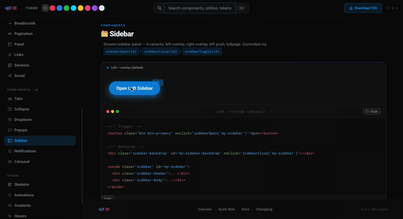

# CSS Library — Documentation

> Entry file: `css/style.css`  
> Architecture: **Design Tokens → System → Components → Sections**

---

## Table of Contents

1. [Installation](#1-installation)
2. [Design Tokens (_base.css)](#2-design-tokens)
3. [Themes (data-theme)](#3-themes)
4. [Responsive Tokens — breakpoints](#4-responsive-tokens)
5. [Responsive Prefix Utils (_responsive.css)](#5-responsive-prefix-utils)
6. [Grid (_grid.css)](#6-grid)
7. [Typography (_typography.css)](#7-typography)
8. [Utilities (_utils.css)](#8-utilities)
9. [Buttons (_buttons.css)](#9-buttons)
10. [Cards (_cards.css)](#10-cards)
11. [Forms (_form.css)](#11-forms)
12. [Gradients (_gradients.css)](#12-gradients)
13. [Animations (_animations.css)](#13-animations)
14. [Navigation (_nav.css)](#14-navigation)
15. [Tabs (_tab.css)](#15-tabs)
16. [Notifications (_notifications.css)](#16-notifications)
17. [Sidebar / Drawer (_sidebar.css)](#17-sidebar--drawer)

---

## 1. Installation

```html
<link rel="stylesheet" href="css/style.css" />
```

`style.css` is the entry point with `@import` only. All styles are modular.

```
_base.css          ← Design Tokens + Responsive Tokens
_reset.css         ← CSS reset
_grid.css          ← Grid system
_typography.css    ← Typography
_utils.css         ← Utilities (Tailwind-style)
...components...
_responsive.css    ← Responsive prefix utilities (sm: md: lg: xl:)
```

---

## 2. Design Tokens

File: `css/_base.css`  
All variables are defined in `:root`. **Change here — applies everywhere.**

### Colors — semantic

```css
--color-primary:  #14a0ff   /* blue */
--color-accent:   #F9063F   /* red */
--color-success:  #9ce700
--color-error:    #d43939
--color-warning:  #ffdd00
```

Each color has shades from 100 (light) to 900 (dark):

```css
--color-primary-100  /* #e6f4ff */
--color-primary-500  /* #14a0ff — base */
--color-primary-900  /* #002050 */
```

### Background and text

```css
--сolor-dark:        #0a0a0a
--color-dark-secondary:   #151515
--color-primary-opacity:        rgba(20,160,255,0.12)
--color-light:      #ffffff
--color-muted:     #8a8f99
```

### Fonts

#### Font role variables (change these to apply globally)

```css
--font-sans:    var(--font-inter)    /* body text */
--font-heading: var(--font-poppins)  /* all headings & .title-* */
--font-mono:    var(--font-roboto-mono) /* code blocks */
```

#### Named font stacks — all loaded via Google Fonts

```css
--font-inter:       "Inter", system-ui, sans-serif
--font-roboto:      "Roboto", -apple-system, sans-serif
--font-poppins:     "Poppins", sans-serif
--font-montserrat:  "Montserrat", sans-serif
--font-outfit:      "Outfit", sans-serif
--font-jakarta:     "Plus Jakarta Sans", sans-serif
--font-dm-sans:     "DM Sans", sans-serif
--font-nunito:      "Nunito", sans-serif
--font-space:       "Space Grotesk", sans-serif
--font-manrope:     "Manrope", sans-serif
--font-figtree:     "Figtree", sans-serif
--font-sora:        "Sora", sans-serif

/* Monospace */
--font-roboto-mono: "Roboto Mono", monospace
--font-jetbrains:   "JetBrains Mono", monospace
--font-fira-code:   "Fira Code", monospace
```

#### Switch fonts globally — one line in your CSS

```css
:root {
  --font-sans:    var(--font-montserrat);
  --font-heading: var(--font-sora);
  --font-mono:    var(--font-jetbrains);
}
```

> Google Fonts are loaded via `@import` in `styles/lib-docs.css` for the docs site.
> In your own project add a `<link>` tag for the fonts you need.

/* Fixed sizes */
--fs-xs:   12px
--fs-sm:   14px
--fs-base: 16px
--fs-lg:   18px
--fs-xl:   20px
--fs-2xl:  24px
--fs-3xl:  30px
--fs-4xl:  36px
--fs-5xl:  48px
--fs-6xl:  60px
--fs-7xl:  72px
--fs-hero: 96px

/* Fluid (responsive via clamp) */
--fs-f-base: clamp(14px, 1.4vw, 16px)
--fs-f-hero: clamp(60px, 10vw, 120px)
/* etc. */
```

### Spacing scale

```css
--space-1:  4px
--space-2:  8px
--space-3:  12px
--space-4:  16px
--space-5:  20px
--space-6:  24px
--space-8:  32px
--space-10: 40px
--space-12: 48px
--space-16: 64px
--space-20: 80px
--space-24: 96px
```

### Border radius

```css
--radius-sm:   6px
--radius-md:   12px
--radius-lg:   20px
--radius-xl:   30px
--radius-2xl:  40px
--radius-full: 9999px
```

### Transitions

```css
--ease-fast: 0.15s ease-in-out
--ease:      0.3s ease-in-out
--ease-slow: 0.5s ease-in-out
```

### Shadows

```css
--shadow-sm:      0 1px 3px rgba(0,0,0,0.3)
--shadow-md:      0 4px 6px rgba(0,0,0,0.4)
--shadow-lg:      0 10px 20px rgba(0,0,0,0.5)
--shadow-primary: 0 0 20px var(--color-primary-shadow)   /* blue glow */
--shadow-accent:  0 0 20px rgba(249,6,63,0.5)    /* red glow */
--shadow-glow:    0 0 30px rgba(255,255,255,0.2)
```

### Z-index scale

```css
--z-0: 0  --z-1: 1  --z-10: 10  --z-50: 50  --z-100: 100  --z-modal: 1000
```

---

## 3. Themes

Switch via the `data-theme` attribute on the `<html>` tag:

```js
document.documentElement.setAttribute('data-theme', 'red')
```

| Theme | `data-theme` |
|-------|-------------|
| Dark (default) | `dark` |
| Light | `light`  |
| Red | `red`    |
| Blue | `blue`   |
| Green | `green`  |
| Cyan | `cyan`   |
| Yellow | `yellow` |
| Pink | `pink`   |
| Purple | `purple` |

```html
<!-- Light theme -->
<html data-theme="light">

<!-- Red theme (casino-style) -->
<html data-theme="red">
```

---

## 4. Responsive Tokens

File: `css/_base.css` (at the end of the file)

All `:root` CSS variables are automatically overridden at each breakpoint.  
**No changes needed** — all components, utilities and typography scale automatically.

### Breakpoints (desktop-first, max-width)

| Breakpoint | Devices | `--fs-hero` | `--fs-base` | `--space-8` |
|---|---|---|---|---|
| base (> 1200px) | Desktop | 96px | 16px | 32px |
| `≤ 1200px` | Laptop / landscape tablet | 80px | 15px | 28px |
| `≤ 768px` | Tablet / mobile | 64px | 14px | 24px |
| `≤ 480px` | Mobile | 48px | 13px | 18px |
| `≤ 390px` | iPhone 14 / standard | 44px | 12px | 16px |
| `≤ 360px` | Android / small | 40px | 11px | 14px |
| `≤ 320px` | Very small | 35px | 10px | 12px |

### What scales automatically

- **Font sizes** — `--fs-xs` … `--fs-hero` and all fluid variants `--fs-f-*`
- **Spacing** — `--space-1` … `--space-24`
- **Border radius** — `--radius-md` … `--radius-2xl`
- **Grid** — `--grid-gutter`, `--container-width`

### Example

```css
/* The .title-hero class uses --fs-hero */
/* At 320px it will automatically become 35px instead of 96px */
/* No additional styles needed */
```

---

## 5. Responsive Prefix Utils

File: `css/_responsive.css`

Tailwind-style responsive prefix class system.  
**Mobile-first** approach: base styles apply to mobile, prefixed classes activate when screen **expands**.

### Breakpoints (mobile-first, min-width)

| Prefix | Active at | Devices |
|---|---|---|
| *(no prefix)* | always | all screens |
| `sm:` | ≥ 480px | large mobile and up |
| `md:` | ≥ 768px | tablet and up |
| `lg:` | ≥ 1200px | desktop |
| `xl:` | ≥ 1400px | wide desktop |

### Syntax

```html
<div class="base-class breakpoint:class">
```

### Covered categories

| Category | Example classes |
|---|---|
| Display | `d-none`, `d-flex`, `d-block`, `d-grid`, `hidden` |
| Flex direction/wrap | `flex-row`, `flex-col`, `flex-wrap`, `flex-nowrap`, `flex-grow` |
| Align / Justify | `items-center`, `items-start`, `justify-between`, `justify-center` |
| Align self | `self-center`, `self-start`, `self-end` |
| Flex combos | `flex-center`, `flex-col-center`, `flex-center-between`, `flex-center-right` |
| Gap | `gap-0` … `gap-24` |
| Padding | `p-*`, `px-*`, `py-*`, `pt-*`, `pb-*`, `pl-*`, `pr-*` |
| Margin | `m-*`, `mx-*`, `my-*`, `mt-*`, `mb-*`, `ml-*`, `mr-*`, `mx-auto`, `ml-auto` |
| Text align | `text-center`, `text-left`, `text-right`, `text-justify` |
| Text transform | `text-uppercase`, `text-lowercase`, `text-capitalize`, `text-nowrap`, `text-wrap` |
| Font size | `text-xs` … `text-6xl` |
| Font weight | `font-thin` … `font-black` |
| Width | `w-full`, `w-auto`, `w-fit`, `w-25`, `w-50`, `w-75`, `w-80`, `w-90`, `w-95` |
| Height | `h-full`, `h-auto`, `h-screen`, `h-dvh`, `h-25`, `h-50`, `h-75` |
| Position | `relative`, `absolute`, `fixed`, `sticky`, `static` |
| Overflow | `overflow-hidden`, `overflow-auto`, `overflow-scroll`, `overflow-x-hidden` |
| Border radius | `rounded-none` … `rounded-full` |
| Opacity | `opacity-0`, `opacity-25`, `opacity-50`, `opacity-75`, `opacity-100` |
| Z-index | `z-0`, `z-1`, `z-10`, `z-50`, `z-100`, `z-modal` |

### Usage examples

```html
<!-- Column on mobile → row on tablet → gap-8 on desktop -->
<div class="flex-col md:flex-row lg:gap-8">...</div>

<!-- Hidden on mobile, visible from tablet -->
<div class="d-none md:d-block">Tablet+ only</div>

<!-- Visible on mobile, hidden on desktop -->
<div class="d-flex lg:d-none">Mobile only</div>

<!-- Center text on mobile, left-aligned on desktop -->
<p class="text-center lg:text-left">...</p>

<!-- Different font sizes per breakpoint -->
<h1 class="text-3xl md:text-5xl lg:text-6xl">Heading</h1>

<!-- Padding grows with screen size -->
<section class="py-4 md:py-8 lg:py-16">...</section>

<!-- Adaptive width -->
<div class="w-full md:w-75 lg:w-50 mx-auto">...</div>

<!-- Flex grid: 1 → 2 → 3 columns -->
<div class="d-flex flex-col sm:flex-row flex-wrap gap-4">
  <div class="w-full sm:w-50 lg:w-full" style="flex:1">...</div>
  <div class="w-full sm:w-50 lg:w-full" style="flex:1">...</div>
</div>
```

### Important — colon escaping

In CSS, the colon in a class name is escaped with a backslash:

```css
/* In _responsive.css it's written as: */
.md\:d-flex { display: flex !important; }

/* In HTML it's used without the backslash: */
<div class="md:d-flex">
```

---

## 6. Grid

File: `css/_grid.css`

### Container

```html
<div class="container">...</div>
```

Max width: `120rem`, centered, width `96%`.

### 12-column Flex grid

```html
<div class="row">
  <div class="col-6">Half</div>
  <div class="col-6">Half</div>
</div>

<div class="row">
  <div class="col-4">1/3</div>
  <div class="col-4">1/3</div>
  <div class="col-4">1/3</div>
</div>
```

**Available classes:** `.col-1` … `.col-12`

**Responsive:**
- `.col-{n}-md` — applies at `min-width: 900px`
- `.col-{n}-lg` — applies at `min-width: 1200px`
- On mobile (< 600px) all columns become 100%

```html
<!-- 2 columns on desktop, 1 on mobile -->
<div class="row">
  <div class="col-12 col-6-md">...</div>
  <div class="col-12 col-6-md">...</div>
</div>
```

### CSS Grid helpers

```html
<div class="grid-col-3"><!-- 3 equal columns via CSS grid --></div>
<div class="col-d2-m1"><!-- 2 cols on desktop, 1 on mobile --></div>
```

---

## 7. Typography

File: `css/_typography.css`

### Headings

| Class | Size | Weight |
|-------|------|--------|
| `.title-hero` | 96px | 900 |
| `.title-xl`   | 72px | 900 |
| `.title-lg`   | 60px | 900 |
| `.title-md`   | 48px | 900 |
| `.title-sm`   | 36px | 800 |
| `.title-xs`   | 30px | 700 |

Add `.fluid` for responsive size via `clamp()`:

```html
<h1 class="title-hero fluid">Heading</h1>
```

### Body text

| Class | Size |
|-------|------|
| `.text-lead`    | 20px, weight 500 |
| `.text-body`    | 16px, weight 400 |
| `.text-sm`      | 14px |
| `.text-xs`      | 12px |
| `.text-caption` | 12px, uppercase, letter-spacing |
| `.text-label`   | 14px, weight 600 |

### Text color

```html
<p class="text-primary">Blue</p>
<p class="text-accent">Red</p>
<p class="text-success">Green</p>
<p class="text-error">Error</p>
<p class="text-warning">Warning</p>
<p class="text-muted">Muted grey</p>
<p class="text-white">White</p>
```

### Text alignment

```html
<p class="text-center">Center</p>
<p class="text-left">Left</p>
<p class="text-right">Right</p>
```

### Font weight

```html
<span class="font-thin">100</span>
<span class="font-light">300</span>
<span class="font-normal">400</span>
<span class="font-medium">500</span>
<span class="font-semi">600</span>
<span class="font-bold">700</span>
<span class="font-extra">800</span>
<span class="font-black">900</span>
```

### Transforms and decorations

```html
<p class="text-upper">UPPERCASE</p>
<p class="text-lower">lowercase</p>
<p class="text-cap">Capitalize</p>
<p class="text-underline">Underlined</p>
<p class="text-line-through">Strikethrough</p>
<p class="text-nowrap">No wrap</p>
```

---

## 8. Utilities

File: `css/_utils.css` — Tailwind-style classes.

### Display / Flex

```html
<div class="d-flex">flex</div>
<div class="d-none">hidden</div>
<div class="flex-col">column</div>
<div class="flex-center">centered (x and y)</div>
<div class="flex-center-between">centered + space-between</div>
<div class="flex-col-center">column centered</div>
<div class="items-center justify-between">...</div>
```

### Spacing (margin / padding)

Format: `.mt-{n}`, `.mb-{n}`, `.ml-{n}`, `.mr-{n}`, `.mx-{n}`, `.my-{n}`  
Format: `.pt-{n}`, `.pb-{n}`, `.pl-{n}`, `.pr-{n}`, `.px-{n}`, `.py-{n}`

Values of n: `0, 1, 2, 3, 4, 5, 6, 8, 10, 12, 16, 20, 24`

```html
<div class="mt-8 px-4">...</div>
<div class="mx-auto">Horizontally centered</div>
```

### Width / Height

```html
<div class="w-full">100%</div>
<div class="w-50">50%</div>
<div class="h-screen">100vh</div>
<div class="min-h-dvh">min-height 100dvh</div>
<div class="w-80">max-width 80%, auto margin</div>
```

### Positioning

```html
<div class="relative">
  <div class="absolute inset-0">overlay</div>
</div>
<div class="fixed top-0 left-0 w-full z-100">header</div>
<div class="translate-center">absolute center (left+top 50% + transform)</div>
```

### Border radius

```html
<div class="rounded-sm">6px</div>
<div class="rounded-md">12px</div>
<div class="rounded-lg">20px</div>
<div class="rounded-full">pill</div>
```

### Background

```html
<div class="bg-primary">blue background</div>
<div class="bg-card">card background</div>
<div class="bg-transparent">transparent</div>
```

### Shadows

```html
<div class="shadow-md">regular shadow</div>
<div class="shadow-primary">blue glow</div>
<div class="shadow-accent">red glow</div>
<div class="shadow-glow">white glow</div>
```

### Borders

```html
<div class="border">grey border</div>
<div class="border-primary">blue border</div>
<div class="border-accent">red border</div>
<div class="border-none">no border</div>
```

### Opacity

```html
<div class="opacity-0">invisible</div>
<div class="opacity-50">50%</div>
<div class="opacity-100">visible</div>
```

### Responsive visibility

```html
<div class="mobile">visible on mobile only (≤768px)</div>
<div class="desktop">visible on desktop only (>768px)</div>
<div class="hide-xs">hidden below 600px</div>
<div class="hide-lg">hidden above 1200px</div>
```

### Gap

```html
<div class="d-flex gap-4">gap 16px</div>
<div class="d-flex gap-8">gap 32px</div>
```

### Transitions

```html
<div class="transition">0.3s</div>
<div class="transition-fast">0.15s</div>
<div class="transition-slow">0.5s</div>
```

---

## 9. Buttons

File: `css/_buttons.css`

### Base button

```html
<button class="btn">Button</button>
```

### Sizes

```html
<button class="btn btn-xs">xs (28px)</button>
<button class="btn btn-sm">sm (36px)</button>
<button class="btn btn-md">md (48px)</button>   <!-- default -->
<button class="btn btn-lg">lg (56px)</button>
<button class="btn btn-xl">xl (64px)</button>
<button class="btn btn-2xl">2xl (72px)</button>
<button class="btn btn-wide">100% width</button>
```

### Color variants

```html
<button class="btn btn-primary">Primary</button>
<button class="btn btn-accent">Accent</button>
<button class="btn btn-success">Success</button>
<button class="btn btn-error">Error</button>
<button class="btn btn-warning">Warning</button>
<button class="btn btn-dark">Dark</button>
<button class="btn btn-light">Light</button>
```

### Outline

```html
<button class="btn btn-outline">Outline Primary</button>
<button class="btn btn-outline-accent">Outline Accent</button>
<button class="btn btn-outline-white">Outline White</button>
```

### Ghost

```html
<button class="btn btn-ghost">Ghost</button>
<button class="btn btn-ghost-primary">Ghost Primary</button>
```

### Gradient

```html
<button class="btn btn-gradient">Gradient</button>
<button class="btn btn-gradient-hover">Animated Gradient</button>
<button class="btn btn-gradient-1">Ocean Blue</button>
<button class="btn btn-gradient-2">Pink Peach</button>
<button class="btn btn-gradient-3">Mint</button>
<button class="btn btn-gradient-4">Gold Glow</button>
<button class="btn btn-gradient-5">Purple</button>
```

### Special effects

```html
<button class="btn btn-glow">Glow (pulse)</button>
<button class="btn btn-glow-primary">Glow Primary</button>
<button class="btn btn-shine">Shine sweep</button>
<button class="btn btn-rainbow">Rainbow animated</button>
<button class="btn btn-animated-bg">Animated BG</button>
<button class="btn btn-glow-hover">Glow on Hover</button>
<button class="btn btn-bounce">Bounce on hover</button>
<button class="btn btn-color-shift pulse">Color Shift</button>
```

### Gradient border

```html
<div class="btn-wrapper-effect">
  <button class="btn btn-gradient-border">
    Button
    <span class="btn-bg-effect"></span>
  </button>
</div>
```

### Disabled state

```html
<button class="btn btn-primary" disabled>Disabled</button>
<button class="btn btn-primary is-disabled">Disabled</button>
```

### Bulma-style `.button`

```html
<button class="button">Default</button>
<button class="button is-primary">Primary</button>
<button class="button is-accent is-rounded">Rounded</button>
<button class="button is-success is-large">Large</button>
<button class="button is-outlined">Outlined</button>
<button class="button is-loading">Loading...</button>
<button class="button is-fullwidth">Full Width</button>

<!-- Button group -->
<div class="buttons">
  <button class="button">A</button>
  <button class="button is-primary">B</button>
</div>
```

---

## 10. Cards

File: `css/_cards.css`

```html
<!-- Base -->
<div class="card">Content</div>

<!-- Glassmorphism -->
<div class="card-glass">Content</div>

<!-- Dark -->
<div class="card-dark">Content</div>

<!-- Bordered -->
<div class="card-bordered">Content</div>
<div class="card-bordered-primary">Blue border with glow</div>
<div class="card-bordered-accent">Red border</div>

<!-- Gradient -->
<div class="card-gradient">Content</div>

<!-- Glow -->
<div class="card-glow">Content</div>

<!-- Primary card (max-width 600px) -->
<div class="card-primary">Content</div>
```

### Card text elements

```html
<div class="card">
  <div class="card-title">Title</div>
  <div class="card-subtitle">Subtitle</div>
  <div class="card-text">Body text</div>
</div>
```

### Bulma-style card

```html
<div class="card-bulma">
  <div class="card-header">
    <span class="card-header-title">Title</span>
    <button class="card-header-icon">⚙</button>
  </div>
  <div class="card-content">Main content</div>
  <div class="card-footer">
    <a class="card-footer-item">Link</a>
    <a class="card-footer-item">More</a>
  </div>
</div>
```

### Card grids

```html
<div class="card-grid">
  <div class="card">1</div>
  <div class="card">2</div>
  <div class="card">3</div>
</div>

<div class="card-list">
  <div class="card">List item</div>
  <div class="card">List item</div>
</div>
```

### Box

```html
<div class="box">Simple box</div>
<div class="box-glass">Glass box</div>
```

---

## 11. Forms

File: `css/_form.css`

### Native inputs (auto-styled)

All `input`, `select`, `textarea` are styled automatically — nothing extra needed.

```html
<input type="text" placeholder="Name" />
<input type="email" placeholder="Email" />
<select><option>Option</option></select>
<textarea placeholder="Message"></textarea>
```

### Form group

```html
<div class="form-group">
  <label class="form-label">Email</label>
  <input type="email" placeholder="user@mail.com" />
  <span class="form-hint">We'll use this to contact you</span>
</div>

<!-- Error state -->
<div class="form-group error">
  <label class="form-label">Email</label>
  <input type="email" />
  <span class="form-error-msg">Invalid format</span>
</div>

<!-- Success state -->
<div class="form-group success">
  <input type="text" />
  <span class="form-success-msg">Looks great!</span>
</div>
```

### Floating Label (label rises on focus/input)

```html
<div class="input-group">
  <input class="input" type="text" placeholder=" " />
  <label class="user-label">Your name</label>
</div>
```

### Input error / success state

```html
<input class="error" type="text" />
<input class="success" type="text" />
```

### Radio group (custom)

```html
<div class="radio-input">
  <label class="label">
    <input type="radio" name="choice" value="1" />
    Option 1
  </label>
  <label class="label">
    <input type="radio" name="choice" value="2" />
    Option 2
  </label>
  <label class="label">
    <input type="radio" name="choice" value="3" />
    Option 3
  </label>
</div>
```

### Lead-gen form (`.form.tg-list`)

```html
<form class="form tg-list">
  <div class="form-group">
    <label>Your name</label>
    <input type="text" placeholder="Enter name" />
  </div>
  <div class="form-group">
    <label>Email</label>
    <input type="email" placeholder="email@mail.com" />
  </div>
  <div class="button-wrapp">
    <button type="submit" class="btn btn-gradient-hover">Submit</button>
  </div>
</form>
```

### Shake animation (on error)

```js
formElement.classList.add('shake-popup')
setTimeout(() => formElement.classList.remove('shake-popup'), 500)
```

---

## 12. Gradients

File: `css/_gradients.css`

### Background gradients — semantic

```html
<div class="gradient-primary">blue</div>
<div class="gradient-accent">red</div>
<div class="gradient-success">green</div>
<div class="gradient-error">error</div>
<div class="gradient-warning">yellow</div>
```

### Background gradients — presets

```html
<div class="gradient-ocean">ocean blue</div>
<div class="gradient-sky">blue-purple</div>
<div class="gradient-sunset">sunset</div>
<div class="gradient-fire">fire</div>
<div class="gradient-nature">nature</div>
<div class="gradient-gold">gold</div>
<div class="gradient-honey">honey</div>
<div class="gradient-cosmic">cosmic</div>
<div class="gradient-galaxy">galaxy</div>
<div class="gradient-rainbow">rainbow</div>
<div class="gradient-gold-metal">gold metal</div>
<div class="gradient-silver">silver</div>
```

### Dark gradients

```html
<div class="gradient-dark-midnight">dark grey</div>
<div class="gradient-dark-void">dark blue</div>
<div class="gradient-dark-shadow">black</div>
```

### Text gradients

```html
<h2 class="gradient-primary text-gradient-primary">Blue text</h2>
<h2 class="text-gradient-gold">Gold text</h2>
<h2 class="text-gradient-rainbow">Rainbow text</h2>
<h2 class="text-gradient-metallic">Metallic</h2>
<h2 class="text-gradient-cosmic">Cosmic</h2>
```

### Gradient borders

```html
<div class="border-gradient-primary rounded-md p-4">Blue border</div>
<div class="border-gradient-accent rounded-md p-4">Red border</div>
<div class="border-gradient-rainbow rounded-md p-4">Rainbow border</div>
<div class="border-gradient-gold rounded-md p-4">Gold border</div>
```

### Animated gradients

```html
<div class="gradient-animated">smoothly animated background</div>
<div class="gradient-animated-subtle">subtle animated</div>
```

### Overlays

```html
<div class="gradient-overlay-dark">
  
  <!-- dark gradient will appear at the bottom -->
</div>
<div class="gradient-overlay-primary">...</div>
```

### Hover sweep effect

```html
<div class="hover-gradient-animate p-4">
  Light sweep on hover
</div>
```

### Direction utilities (via CSS variables)

```html
<div class="gradient-horizontal" style="--gradient-from: #ff0; --gradient-to: #f0f">→</div>
<div class="gradient-vertical">↓</div>
<div class="gradient-diagonal">↘</div>
<div class="gradient-radial">⊙</div>
```

---

## 13. Animations

File: `css/_animations.css`

Just add a class to any element.

### Fade

```html
<div class="animate-fade-in">fade in</div>
<div class="animate-fade-out">fade out</div>
<div class="animate-fade-in-up">from bottom</div>
<div class="animate-fade-in-down">from top</div>
<div class="animate-fade-in-left">from left</div>
<div class="animate-fade-in-right">from right</div>
```

### Scale / Bounce

```html
<div class="animate-scale-in">scale in appearance</div>
<div class="animate-scale">pulsing scale (1x)</div>
<div class="animate-scale-big">pulsing scale (big)</div>
<div class="animate-bounce">bounce</div>
<div class="animate-bounce-in">bounce on enter</div>
```

### Float

```html
<div class="animate-float">floating (±10px)</div>
<div class="animate-float-big">floating (±20px)</div>
```

### Rotate / Spin

```html
<div class="animate-spin">spinning</div>
<div class="animate-spin-slow">spinning slowly</div>
<div class="animate-rotate">rotate 90°</div>
```

### Shake / Wiggle

```html
<div class="animate-shake">shake</div>
<div class="animate-wiggle">wiggle</div>
```

### Pulse / Glow / Heartbeat

```html
<div class="animate-pulse">pulse</div>
<div class="animate-heartbeat">heartbeat</div>
<div class="animate-glow">blue glow</div>
<div class="animate-glow-accent">red glow</div>
<div class="animate-border-pulse">pulsing border</div>
```

### Text effects

```html
<span class="animate-rainbow">rainbow shadow</span>
<span class="animate-neon">neon yellow</span>
<span class="animate-neon-blue">neon blue</span>
<span class="animate-breathe">breathe</span>
<!-- Scan effect (requires data-text attribute) -->
<span class="animate-scan" data-text="TEXT">TEXT</span>
```

### Shadow / Shimmer

```html
<div class="shadow-neon">white neon glow</div>
<div class="shadow-neon-primary">blue neon glow</div>
<div class="animate-shimmer">skeleton loading effect</div>
```

### Misc

```html
<div class="animate-flip">3D flip</div>
<div class="animate-rubber">rubber band</div>
<div class="animate-tada">tada</div>
```

### Speed and delay control

```html
<div class="animate-bounce anim-fast">fast (0.3s)</div>
<div class="animate-bounce anim-slow">slow (2s)</div>
<div class="animate-bounce anim-slower">very slow (4s)</div>

<div class="animate-fade-in anim-delay-3">delay 0.3s</div>
<div class="animate-fade-in anim-delay-1s">delay 1s</div>
<div class="animate-bounce anim-paused">paused</div>
<div class="animate-bounce anim-none">no animation</div>
```

---

## 14. Navigation

File: `css/_nav.css`

### Base structure

```html
<nav class="nav">
  <div class="nav-left">
    <a class="nav-brand" href="#">
      
      Brand
    </a>
  </div>
  <div class="nav-center">
    <a href="#" class="nav-link is-active">Home</a>
    <a href="#" class="nav-link">About</a>
    <span class="nav-sep"></span>
    <a href="#" class="nav-link">Contact</a>
  </div>
  <div class="nav-right">
    <button class="btn btn-primary btn-sm">Sign In</button>
  </div>
</nav>
```

### Navbar variants

```html
<nav class="nav nav-glass">glass (backdrop-filter)</nav>
<nav class="nav nav-solid">solid with border</nav>
<nav class="nav nav-primary">blue tint</nav>
<nav class="nav nav-dark">always dark</nav>
<nav class="nav nav-floating">floating (pill, rounded)</nav>
```

### Sizes

```html
<nav class="nav nav-sm">small (48px)</nav>
<nav class="nav nav-lg">large (72px)</nav>
```

### Link style — underline

```html
<nav class="nav nav-underline">
  <a href="#" class="nav-link is-active">Active</a>
  <a href="#" class="nav-link">Regular</a>
</nav>
```

### Active link

```html
<a href="#" class="nav-link is-active">Active (class)</a>
<a href="/home" class="nav-link" aria-current="page">Active (aria)</a>
```

---

## 15. Tabs

File: `css/_tab.css`

### Base structure

```html
<div class="tab-wrap">
  <div class="tab-nav">
    <button class="tab-btn is-active" onclick="tabSwitch(this)">Tab 1</button>
    <button class="tab-btn" onclick="tabSwitch(this)">Tab 2</button>
    <button class="tab-btn" onclick="tabSwitch(this)">
      Tab 3
      <span class="tab-badge">3</span>
    </button>
  </div>
  <div class="tab-content">
    <div class="tab-panel is-active">Content 1</div>
    <div class="tab-panel">Content 2</div>
    <div class="tab-panel">Content 3</div>
  </div>
</div>
```

Minimal JS for switching (already included in `njx.js`):

```js
function tabSwitch(btn) {
  const nav = btn.closest('.tab-nav');
  const wrap = btn.closest('.tab-wrap');
  nav.querySelectorAll('.tab-btn').forEach(b => b.classList.remove('is-active'));
  btn.classList.add('is-active');
  const idx = [...nav.querySelectorAll('.tab-btn')].indexOf(btn);
  wrap.querySelectorAll('.tab-panel').forEach((p, i) => {
    p.classList.toggle('is-active', i === idx);
  });
}
```

### Nav variants

```html
<div class="tab-nav tab-nav-pills"><!-- rounded pills --></div>
<div class="tab-nav tab-nav-boxed"><!-- border around active --></div>
<div class="tab-nav tab-nav-card"><!-- VS Code style, colored top line --></div>
```

### Sizes

```html
<div class="tab-nav tab-nav-sm">small</div>
<div class="tab-nav tab-nav-lg">large</div>
```

### Full width

```html
<div class="tab-nav is-full">...</div>
```

### Content with border

```html
<div class="tab-content tab-content-bordered">...</div>
```

---

## 16. Notifications

File: `css/_notifications.css`

### Notification (block)

```html
<div class="notification">Default</div>
<div class="notification is-primary">Info</div>
<div class="notification is-success">Success</div>
<div class="notification is-warning">Warning</div>
<div class="notification is-danger">Error</div>
<div class="notification is-info">Info</div>

<!-- With close button -->
<div class="notification is-primary">
  Notification text
  <button class="delete"></button>
</div>
```

### Toast (animated popup)

```html
<div class="toast toast-primary">Primary</div>
<div class="toast toast-success">Success!</div>
<div class="toast toast-error">Error!</div>
<div class="toast toast-warning">Warning!</div>
<div class="toast toast-dark">Dark</div>
```

### Message (header + body)

```html
<div class="message is-primary">
  <div class="message-header">
    <span>Title</span>
    <button class="delete"></button>
  </div>
  <div class="message-body">Message body</div>
</div>
```

### Progress bar

```html
<!-- Native <progress> -->
<progress class="progress" value="70" max="100"></progress>
<progress class="progress is-accent is-medium" value="50" max="100"></progress>

<!-- Custom (for animation and color) -->
<div class="progress-bar">
  <div class="progress-bar-fill" style="width: 65%"></div>
</div>
<div class="progress-bar">
  <div class="progress-bar-fill is-gradient is-animated" style="width: 80%"></div>
</div>
```

### Loader / Spinner

```html
<span class="loader"></span>
<span class="loader loader-sm loader-accent"></span>
<span class="loader loader-lg loader-success"></span>
<span class="loader loader-xl loader-white"></span>

<!-- Full-page overlay -->
<div class="loader-overlay">
  <span class="loader loader-xl"></span>
</div>
```

### Delete button (×)

```html
<button class="delete"></button>
<button class="delete is-small"></button>
<button class="delete is-medium"></button>
<button class="delete is-large"></button>
```

---

## 17. Sidebar / Drawer

File: `css/_sidebar.css`

<div align="center">



</div>

### CSS Variables

```css
--sidebar-width:    280px;
--sidebar-bg:       var(--color-dark-secondary);
--sidebar-border:   color-mix(in srgb, var(--color-neutral-600) 25%, transparent);
--sidebar-shadow:   0 8px 48px rgba(0, 0, 0, 0.38);
--sidebar-duration: 0.28s;
```

### Base structure — left overlay (default)

```html
<!-- Trigger -->
<button class="btn btn-primary" onclick="sidebarOpen('my-sidebar')">Open</button>

<!-- Backdrop (click outside to close) -->
<div class="sidebar-backdrop" id="my-sidebar-backdrop" onclick="sidebarClose('my-sidebar')"></div>

<!-- Sidebar -->
<aside class="sidebar" id="my-sidebar">
  <div class="sidebar-header">
    <span class="sidebar-title">Menu</span>
    <button class="sidebar-close" onclick="sidebarClose('my-sidebar')">✕</button>
  </div>
  <div class="sidebar-body">
    <nav class="sidebar-nav">
      <a class="sidebar-link is-active" href="#">Dashboard</a>
      <a class="sidebar-link" href="#">Profile</a>
      <a class="sidebar-link" href="#">Settings</a>
    </nav>
  </div>
  <div class="sidebar-footer">Footer content</div>
</aside>
```

### Variants

| Class | Description |
|---|---|
| `.sidebar` | Left overlay (default) |
| `.sidebar.sidebar-right` | Slides from right |
| `.sidebar.sidebar-push` | Pushes page content (needs `.sidebar-layout`) |
| `.sidebar.sidebar-fullpage` | Full viewport overlay |
| `.sidebar.sidebar-mini` | Icon rail — always visible, collapses to icons |
| `.sidebar.sidebar-floating` | Detached, rounded, glassmorphism |

### Right overlay

```html
<aside class="sidebar sidebar-right" id="my-sidebar">...</aside>
```

### Push (shifts page content)

Requires a wrapper around the sidebar and the page content:

```html
<div class="sidebar-layout">
  <aside class="sidebar sidebar-push" id="my-sidebar">...</aside>
  <div class="sidebar-content">...page content...</div>
</div>

<!-- Push from right -->
<div class="sidebar-layout">
  <div class="sidebar-content">...page content...</div>
  <aside class="sidebar sidebar-push sidebar-right" id="my-sidebar">...</aside>
</div>
```

### Fullpage overlay

```html
<aside class="sidebar sidebar-fullpage" id="my-sidebar">
  <div class="sidebar-header">
    <span class="sidebar-title">Menu</span>
    <button class="sidebar-close sidebar-close-lg" onclick="sidebarClose('my-sidebar')">✕</button>
  </div>
  <div class="sidebar-fullpage-body">
    <nav class="sidebar-fullpage-nav">
      <a class="sidebar-fullpage-link" href="#">Home</a>
      <a class="sidebar-fullpage-link" href="#">About</a>
      <a class="sidebar-fullpage-link" href="#">Contact</a>
    </nav>
  </div>
</aside>
```

### Mini / Icon rail

Always visible, collapses to icons. Wrap text in `.sidebar-link-text` so it hides when collapsed:

```html
<div class="sidebar-layout">
  <aside class="sidebar sidebar-push sidebar-mini" id="my-sidebar">
    <div class="sidebar-header">
      <span class="sidebar-brand-logo">N</span>
      <button class="sidebar-mini-toggle" onclick="sidebarExpandToggle('my-sidebar')">▶</button>
    </div>
    <div class="sidebar-body">
      <nav class="sidebar-nav">
        <a class="sidebar-link is-active" href="#">
          <svg>...</svg>
          <span class="sidebar-link-text">Dashboard</span>
        </a>
      </nav>
    </div>
  </aside>
  <div class="sidebar-content">...page content...</div>
</div>
```

### Floating

```html
<aside class="sidebar sidebar-floating" id="my-sidebar">...</aside>

<!-- Floating from right -->
<aside class="sidebar sidebar-floating sidebar-right" id="my-sidebar">...</aside>
```

### Inner elements

| Element | Description |
|---|---|
| `.sidebar-header` | Top bar with title and close button |
| `.sidebar-title` | Title text in header |
| `.sidebar-brand` | Logo + brand name wrapper |
| `.sidebar-brand-logo` | Logo mark / monogram |
| `.sidebar-brand-text` | Brand subtitle |
| `.sidebar-close` | × close button (`sidebar-close-lg` — bigger, red hover) |
| `.sidebar-body` | Scrollable content area |
| `.sidebar-nav` | Vertical link list container |
| `.sidebar-link` | Navigation link (add `.is-active` for active state) |
| `.sidebar-link-text` | Text label — hidden in mini collapsed mode |
| `.sidebar-label` | Section heading label (uppercase, muted) |
| `.sidebar-divider` | Horizontal separator line |
| `.sidebar-footer` | Fixed bottom area |
| `.sidebar-backdrop` | Dimmed overlay behind the sidebar |

### JS API

```js
sidebarOpen('my-sidebar')          // open
sidebarClose('my-sidebar')         // close
sidebarToggle('my-sidebar')        // toggle open/close
sidebarExpandToggle('my-sidebar')  // toggle mini ↔ expanded (mini variant only)
```

---

## Quick Reference — Common Patterns

```html
<!-- Full-screen centering -->
<div class="flex-center h-screen">
  <div class="card-primary">Content</div>
</div>

<!-- Hero section -->
<section class="flex-col-center text-center py-24 px-4">
  <h1 class="title-hero fluid animate-fade-in-down">Heading</h1>
  <p class="text-lead text-muted mt-4 animate-fade-in-up">Subheading</p>
  <button class="btn btn-gradient-hover mt-8">Get Started</button>
</section>

<!-- Card grid -->
<div class="card-grid gap-5 w-90">
  <div class="card-glass animate-fade-in">Card 1</div>
  <div class="card-glass animate-fade-in anim-delay-2">Card 2</div>
  <div class="card-glass animate-fade-in anim-delay-3">Card 3</div>
</div>

<!-- Registration form -->
<div class="card-primary">
  <form class="form tg-list">
    <div class="form-group">
      <label class="form-label">Name</label>
      <input type="text" placeholder="Your name" />
    </div>
    <button class="btn btn-gradient-hover w-full mt-4">Sign Up</button>
  </form>
</div>

<!-- Gradient text + animation -->
<h2 class="title-lg fluid text-gradient-gold animate-neon">CASINO</h2>
```

---

## Quick Reference — Responsive

```html
<!-- Column on mobile → row on tablet -->
<div class="flex-col md:flex-row gap-4 md:gap-8">
  <div class="w-full md:w-50">Half</div>
  <div class="w-full md:w-50">Half</div>
</div>

<!-- Hidden on mobile, visible on desktop -->
<aside class="d-none lg:d-block">Sidebar</aside>

<!-- Visible on mobile only -->
<nav class="d-flex lg:d-none">Mobile navbar</nav>

<!-- Heading size grows with screen -->
<h1 class="text-3xl md:text-5xl lg:text-6xl font-black text-center">
  Heading
</h1>

<!-- Padding increases on wider screens -->
<section class="py-6 px-4 md:py-12 md:px-8 lg:py-20 lg:px-16">
  Section
</section>

<!-- Center only on desktop -->
<div class="text-left md:text-center lg:text-left">Text</div>

<!-- Flex → Grid on desktop -->
<div class="d-flex flex-col sm:flex-row flex-wrap gap-4 lg:gap-8">
  <div class="w-full sm:w-50 lg:w-full" style="flex:1 1 200px">Item</div>
  <div class="w-full sm:w-50 lg:w-full" style="flex:1 1 200px">Item</div>
  <div class="w-full sm:w-50 lg:w-full" style="flex:1 1 200px">Item</div>
</div>

<!-- Button: small on mobile → large on desktop -->
<button class="btn btn-primary text-sm md:text-base lg:text-lg py-2 md:py-4">
  Click me
</button>
```

---

## Theme Switching

```js
// Switch theme programmatically
function setTheme(theme) {
  document.documentElement.setAttribute('data-theme', theme);
  localStorage.setItem('theme', theme);
}

// Restore saved theme
const saved = localStorage.getItem('theme') || 'dark';
document.documentElement.setAttribute('data-theme', saved);
```

---

## Overriding Library Styles

### 1. Load order — always put your file last

```html
<link rel="stylesheet" href="njx/style.min.css" /> <!-- library first -->
<link rel="stylesheet" href="global.css" />         <!-- your styles second -->
```

### 2. Override via CSS variables — recommended

The cleanest approach. All components consume tokens, so changing a token changes everything at once.

```css
/* global.css */
:root {
  --color-primary:  #ff6b35;
  --color-accent:   #ffd700;
  --font-sans:      var(--font-montserrat);
  --font-heading:   var(--font-sora);
  --radius-md:      999px; /* pill-shaped components */
}
```

### 3. Override a component class — write it later in your file

```css
/* global.css */
.btn-primary {
  background: #ff6b35;
  border-radius: 999px;
}
```

### 4. Increase specificity with a wrapper class

```css
.my-app .btn-primary {
  background: #ff6b35; /* wins over library's .btn-primary */
}
```

### 5. Double class trick — no wrapper needed

```css
.btn-primary.btn-primary {
  background: #ff6b35; /* doubled specificity */
}
```

### 6. CSS `@layer` — modern priority control

```css
@layer njx, overrides;

@layer overrides {
  .btn-primary { background: #ff6b35; } /* always wins over njx layer */
}
```

### 7. `!important` — last resort for utility overrides

```css
/* Fine for utilities */
.hidden { display: none !important; }

/* Avoid for components — use specificity instead */
```

---

## CSS Specificity Reference

```
[inline]  [id]  [class / attr / pseudo]  [tag]
   1        1             1                1

p                    →  0-0-0-1
.btn                 →  0-0-1-0
.btn.btn             →  0-0-2-0  (double class trick)
#hero                →  0-1-0-0
.app .btn            →  0-0-2-0
:where(.btn)         →  0-0-0-0  (zero — easy to override)
:is(#app, .btn)      →  0-1-0-0  (inherits highest — #app)
```

> **Library convention:** base component styles use `:where()` so a single class in your file always overrides. Utility classes (`.d-none`, `.text-center`, etc.) use `!important` by design.
